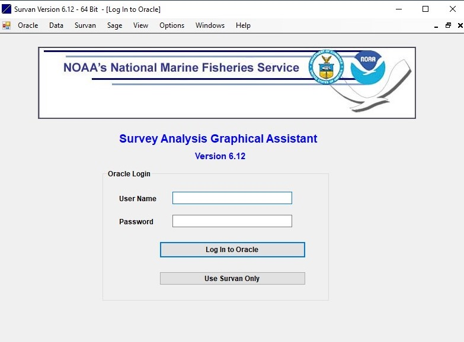

# SAGA_info

This site is to help people interested in using the Survey Analysis Graphical Assistant (SAGA) program to derive stratified mean indices from NEFSC survey data. Please help keep it up to date with any new information you have.  

**Please note** that the Population Dynamics Branch agreed in 2021 to use the area of each tow when computing stratified mean indices for NEFSC bottom trawl surveys conducted on the Bigelow. SAGA does not have the ability to do these calculations, so should not be used for Bigelow years. It can still be used to explore the effect of changes in strata based on the assumption that every tow is equal, but should not be used in any final assessments. The Stock Efficiency Initiative (StockEff) provides the area of each tow calculations and Alicia Miller has developed an R Shiny app to allow one-off explorations available at http://155.206.139.48:3838/amiller/SAGAbeta/ (and code is available at net.nefsc.noaa.gov/shiny1/amiller/SAGAbeta/ if you're interested).

The SAGA program was developed by Al Seaver and has the same look and feel of the NOAA Fisheries Toolbox programs. It has a graphical user interface written in Visual Basic that requires an ITD HelpDesk ticket to be installed. The zip file for installation is available at \\net.nefsc.noaa.gov\home0\pdy\pub\SAGA_for_Windows10 called SAGAV6.12_64-Bit.zip. There is also a file called SAGA Oracle Dlls.zip in this directory. Once you have SAGA installed, you should unzip the files in this second zip file and put them in the same directory as your SAGA.exe file. You should have ITD do this when SAGA is installed, there have been cases where the folder cannot be written to without administrative rights. These dll files were developed by Mark Beauregard and allow SAGA to connect to the Oracle databases.  

**Please note**, the Population Dynamics Branch has made an agreement with ITD that SAGA can be installed on our laptops, but that ITD will not provide support to get SAGA to work. So please do not submit ITD HelpDesk tickets if you cannot get SAGA to work. Instead, please follow the directions here and/or work with other members of the Population Dynamics Branch to get your SAGA program working. If needed, someone with a working version of SAGA can pull the data from Oracle and then you can run the Survan portion yourself (see first screen of SAGA below).  

## About SAGA 

SAGA collects data from Oracle using sql commands and then computes stratified mean indices following the logic of the old Survan program. It has a graphical user interface to allow point and click selections with many drop down menus to ensure correct application of choices. When the data are pulled from Oracle, SAGA conducts a number of checks on the data and provides the user an ability to fix any problems found. Conversion factors for vessel, gear, and doors in the Albatross era (1963-2008) can be applied and conversion from Bigelow to Albatross units can be made. Once the data are fixed and converted, they are saved to csv files for use in the Survan portion of the program. The SAGE module allows the user the ability to fill holes in age-length keys when deriving indices at age (for fish that aged). Bootstrapping the data to derive confidence intervals of derived quantities can be done. The program provides output in a number of plots and csv files.

## Oracle connections

Since SAGA pulls data directly from NEFSC Oracle servers, users must have the ability to connect to Oracle. This can be checked through PuTTY, SQLdeveloper, Toad, or other programs that allow selecting data from Oracle tables. Users will need to have a tnsnames.ora file on their computer. Please use one of these other programs to have ITD help you get connected to Oracle databases, not SAGA. If you can connect to Oracle using these other programs, then you should be able to use SAGA as well, you just may need to copy the dll files noted above.

